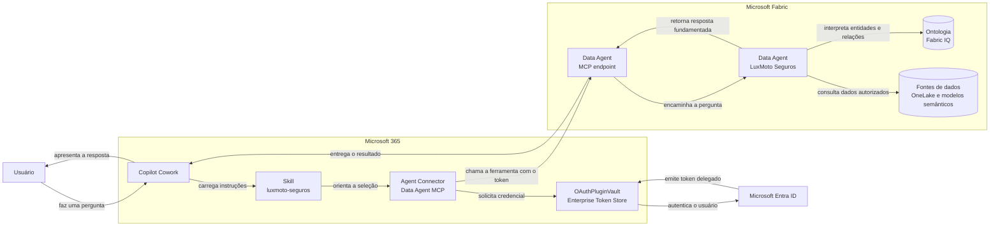
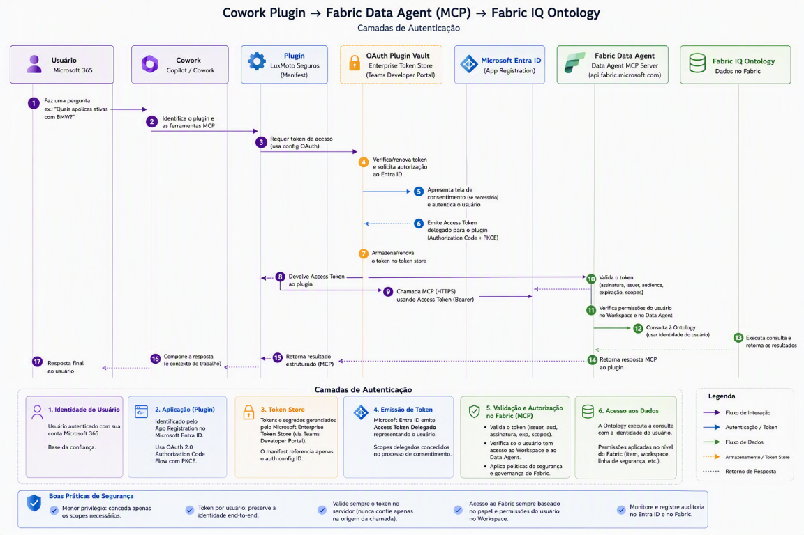

# Plugin Cowork para o Fabric Data Agent da LuxMoto Seguros

Este repositório contém um plugin para Microsoft 365 Copilot Cowork que consulta o Data Agent da LuxMoto Seguros no Microsoft Fabric. O Data Agent está fundamentado em uma ontologia Fabric IQ com dados de apólices, clientes, motocicletas, classes de risco, valores segurados e coberturas.

O pacote combina:

- um `agentConnector` conectado diretamente ao MCP do Fabric Data Agent;
- uma `agentSkill` que orienta o Cowork a acionar o conector, preservar filtros e formatar resultados;
- autenticação delegada Microsoft Entra por `OAuthPluginVault`;
- um script PowerShell que valida e gera o ZIP aceito pelo Cowork.

 
````
Este artigo não aborda a criação do Data Agent no Microsoft Fabric nem a configuração de suas fontes, como Lakehouse, Ontologia e Modelo Semântico. O projeto pressupõe que esses recursos já estejam criados e configurados. O objetivo é demonstrar como consumir o Data Agent por meio de um plugin do Microsoft 365 Copilot Cowork.
````

## Arquitetura

O diagrama apresenta o fluxo principal da esquerda para a direita. O Microsoft Entra ID autentica o usuário, enquanto o Data Agent consulta a ontologia e as fontes configuradas no Fabric.

O Data Agent MCP expõe uma única ferramenta. O Cowork envia a pergunta completa para essa ferramenta e recebe uma resposta fundamentada nas fontes configuradas no Data Agent.





## Identificadores usados

| Recurso | Valor |
|---|---|
| Workspace ID | `<WORKSPACE_ID>` |
| Data Agent ID | `<DATA_AGENT_ID>` |
| Manifest app ID | `<MANIFEST_APP_ID>` |
| MCP tool name | `<DATA_AGENT_MCP_TOOL_NAME>` |
| OAuth client registration ID | `<OAUTH_CLIENT_REGISTRATION_ID>` |

Um OAuth client registration ID pode ter um formato codificado semelhante a:

```text
NWJlOGFhNjQtNjIxMy0...
```

Endpoint MCP:

```text
https://api.fabric.microsoft.com/v1/mcp/workspaces/<WORKSPACE_ID>/dataagents/<DATA_AGENT_ID>/agent
```

## Estrutura do projeto

```text
ontology-cowork-plugin/
├── manifest.json
├── toolDescription.json
├── color.png
├── outline.png
├── package.ps1
├── README.md
├── skills/
│   └── luxmoto-seguros/
│       └── SKILL.md
└── build/
    └── luxmoto-data-agent-cowork-plugin.zip
```

O arquivo `package.ps1` é usado somente durante o desenvolvimento. Ele não é incluído no ZIP instalado no Cowork.

### Estrutura do plugin ZIP

O arquivo `luxmoto-data-agent-cowork-plugin.zip` deve conter somente os arquivos necessários para execução do plugin:

```text
luxmoto-data-agent-cowork-plugin.zip
├── manifest.json
├── toolDescription.json
├── color.png
├── outline.png
└── skills/
    └── luxmoto-seguros/
        └── SKILL.md
```

Os arquivos devem estar diretamente na raiz do ZIP, conforme a estrutura acima. Não inclua a pasta `ontology-cowork-plugin`, caminhos absolutos, barras invertidas, referências a diretórios pai, `package.ps1`, `README.md` ou a pasta `build`.

## Pré-requisitos

- Um tenant Microsoft 365 com Microsoft 365 Copilot Cowork.
- Um workspace Microsoft Fabric em capacidade compatível.
- Um Data Agent criado e publicado.
- A ontologia e as demais fontes de dados configuradas no Data Agent.
- Uma conta do mesmo tenant com, no mínimo, a função **Viewer** no workspace e acesso ao Data Agent e às fontes.
- Permissão para criar App Registrations no Microsoft Entra.
- Acesso ao Teams Developer Portal para registrar a configuração OAuth.

## Configurar o Data Agent no Fabric

1. Abra o Data Agent no Microsoft Fabric.
2. Configure a ontologia e as demais fontes de dados.
3. Defina instruções e exemplos adequados para as perguntas de seguros.
4. Publique o Data Agent. O endpoint MCP só funciona para um Data Agent publicado.
5. Abra **Settings**.
6. Abra a aba **Model Context Protocol**.
7. Confirme os seguintes valores:
   - MCP server URL;
   - Data agent MCP tool name;
   - descrição da ferramenta.
8. Opcionalmente, baixe o arquivo `mcp.json` para conferir o endpoint.

O endpoint segue este formato:

```text
https://api.fabric.microsoft.com/v1/mcp/workspaces/<WORKSPACE_ID>/dataagents/<DATA_AGENT_ID>/agent
```

## Criar o App Registration

Crie o App Registration no mesmo tenant que hospeda o Data Agent.

1. Abra o Microsoft Entra admin center.
2. Acesse **App registrations**.
3. Selecione **New registration**.
4. Use uma conta single tenant:

   ```text
   Accounts in this organizational directory only
   ```

5. Depois da criação, anote:
   - Application (client) ID;
   - Directory (tenant) ID.

### Configurar a redirect URI

1. No App Registration, abra **Authentication**.
2. Adicione uma plataforma **Web**.
3. Use esta redirect URI:

   ```text
   https://teams.microsoft.com/api/platform/v1.0/oAuthRedirect
   ```

### Criar o client secret

1. Abra **Certificates & secrets**.
2. Selecione **New client secret**.
3. Defina uma expiração compatível com a política da organização.
4. Copie o valor do secret imediatamente.
5. Não salve o client secret neste repositório.

### Configurar as permissões de API

O fluxo do Cowork usa permissões delegadas do usuário.

1. No App Registration, abra **API permissions**.
2. Selecione **Add a permission**.
3. Selecione **APIs my organization uses**.
4. Procure por **Power BI Service**.
5. Selecione **Delegated permissions**.
6. Adicione:

   | Permissão | Uso |
   |---|---|
   | `Item.Read.All` | Ler o Data Agent e os itens Fabric associados |
   | `Item.Execute.All` | Executar o Data Agent |
   | `Dataset.Read.All` | Ler modelos semânticos Power BI usados como fonte |

7. Se a política do tenant exigir, selecione **Grant admin consent**.

O Power BI Service usa este App ID:

```text
00000009-0000-0000-c000-000000000000
```

O `Dataset.Read.All` é necessário quando o Data Agent usa um modelo semântico Power BI. Manter as três permissões evita uma nova etapa de consentimento se essa fonte for adicionada posteriormente.

As permissões do App Registration não substituem as permissões do usuário no Fabric. O usuário autenticado precisa ter, no mínimo, a função **Viewer** no workspace e acesso ao Data Agent e às fontes. A função no workspace não substitui permissões específicas exigidas por uma ontologia, um modelo semântico ou outra fonte configurada no Data Agent.

## Por que registrar o OAuth no Teams Developer Portal

O Cowork atua como cliente MCP e precisa obter um token do Fabric em nome do usuário antes de chamar o Data Agent. O App Registration e a configuração OAuth no Teams Developer Portal têm responsabilidades complementares:

| Componente | Responsabilidade |
|---|---|
| App Registration no Microsoft Entra ID | Define a identidade OAuth da aplicação, as permissões delegadas, a redirect URI e a credencial |
| Configuração OAuth no Teams Developer Portal | Informa ao runtime do Microsoft 365 como usar o App Registration e armazena o client secret com segurança |
| `referenceId` no manifesto | Identifica a configuração OAuth sem expor credenciais no pacote |
| Cowork | Conduz o login, obtém e renova tokens e envia o bearer token ao servidor MCP |
| Fabric Data Agent MCP | Valida o token e aplica as permissões do usuário no Fabric |

O Teams Developer Portal não substitui o App Registration nem atua como provedor de identidade. Ele fornece a configuração e o armazenamento seguro usados pelo runtime do Microsoft 365.

O OAuthPluginVault funciona como uma camada gerenciada de autenticação entre o Copilot Cowork e o serviço/API exposto pelo plugin, evitando que o plugin precise armazenar ou manipular diretamente credenciais OAuth. A documentação do Cowork recomenda esse modelo para APIs OAuth 2.0, inclusive para cenários de produção.


### Fluxo de autenticação

1. O usuário faz uma pergunta que aciona o Data Agent.
2. O Cowork identifica o connector MCP e lê a configuração `OAuthPluginVault` no manifesto.
3. O runtime encontra a configuração OAuth por meio do `referenceId`.
4. Se ainda não houver um token válido, o usuário é direcionado ao Microsoft Entra ID.
5. O usuário entra com sua conta e concede consentimento quando necessário.
6. O Entra ID retorna um authorization code para a redirect URI do Microsoft 365.
7. O runtime troca o código por um token do Fabric usando a configuração protegida.
8. O token é armazenado no Microsoft Enterprise Token Store e pode ser renovado com `offline_access`.
9. O Cowork chama o endpoint MCP com o bearer token.
10. O Fabric valida o token e verifica o acesso do usuário ao workspace, ao Data Agent e às fontes.

Essa arquitetura atende a uma exigência técnica da plataforma e reforça a segurança. O client secret e os tokens não são distribuídos no plugin, a configuração OAuth pode ser restringida à organização e ao Manifest app ID, e o Fabric continua aplicando as permissões do usuário autenticado.

O fluxo abaixo detalha como o Cowork usa o `OAuthPluginVault`, o Microsoft Entra ID e um token delegado para acessar o Fabric Data Agent. O Fabric valida o token e aplica as permissões do usuário antes de permitir consultas à ontologia.



Atenção:
- Nunca salve client secrets no repositório.
- Não inclua tokens de acesso no manifesto ou na documentação.
- Use `OAuthPluginVault` para manter as credenciais no Microsoft Enterprise Token Store.
- Restrinja o OAuth client registration ao Manifest app ID depois dos testes.
- Defina uma política para rotação do client secret.
- Remova o acesso de usuários que não devem consultar os dados.
- As permissões do Fabric e das fontes continuam sendo aplicadas ao usuário autenticado.

### Por que esta abordagem é necessária

O Fabric Data Agent MCP exige um bearer token válido em todas as requisições. Ele não oferece Dynamic Client Registration nem client identity metadata. Portanto, o Cowork não consegue registrar automaticamente um cliente OAuth no endpoint do Data Agent.

Como o Cowork é um runtime gerenciado, o plugin deve usar uma das formas de autenticação aceitas pela plataforma. Para este fluxo delegado, a configuração prévia do `OAuthPluginVault` no Teams Developer Portal é a abordagem adequada.

Em um cliente MCP desenvolvido pela própria organização, como uma aplicação Python, seria possível usar MSAL ou `azure-identity` para obter o token diretamente. No Cowork, o runtime do Microsoft 365 executa essa responsabilidade.

### Por que o manifesto não se conecta diretamente ao App Registration

O Application (client) ID não é suficiente para executar o fluxo OAuth. O Cowork também precisa dos endpoints de autorização e token, dos scopes, do client secret e da redirect URI. Além disso, o runtime precisa associar o token ao usuário autenticado e renová-lo quando necessário.

Esses dados não devem ser distribuídos no pacote do plugin. Principalmente, o `manifest.json` nunca deve conter o client secret. Por isso, ele inclui somente o tipo `OAuthPluginVault` e um `referenceId` que aponta para a configuração protegida no Microsoft Enterprise Token Store.


## Registrar o OAuth no Teams Developer Portal

1. Abra a página [OAuth client registration](https://dev.teams.microsoft.com/tools/oauth-configuration) no Teams Developer Portal.
2. Selecione **Register client**.

Também é possível acessar essa página pelo menu **Tools** e, em seguida, **OAuth client registration**.

### App settings

| Campo | Valor |
|---|---|
| Registration name | Um nome descritivo, como `OAuthClientFabricDataAgent` |
| Base URL | `https://api.fabric.microsoft.com` |
| Restrict usage by organization | `My organization only` |
| Restrict usage by Teams app | `Any Teams app` durante os testes |

Depois dos testes, restrinja o registro ao app existente e use o Manifest app ID:

```text
<MANIFEST_APP_ID>
```

### OAuth settings

Substitua `<TENANT_ID>` pelo Directory (tenant) ID real. Não salve os endpoints com o texto literal `<TENANT_ID>`.

| Campo | Valor |
|---|---|
| Client ID | Application (client) ID do App Registration |
| Client secret | Secret criado no App Registration |
| Authorization endpoint | `https://login.microsoftonline.com/<TENANT_ID>/oauth2/v2.0/authorize` |
| Token endpoint | `https://login.microsoftonline.com/<TENANT_ID>/oauth2/v2.0/token` |
| Refresh endpoint | `https://login.microsoftonline.com/<TENANT_ID>/oauth2/v2.0/token` |
| Scope | `https://api.fabric.microsoft.com/.default, offline_access` |
| Enable PKCE | Desativado |
| Client password authentication method | `Request body parameters` |

O campo **Scope** usa vírgula para separar os valores. Esta configuração está correta:

```text
https://api.fabric.microsoft.com/.default, offline_access
```

Esta configuração está incorreta:

```text
https://api.fabric.microsoft.com/.default offline_access
```

Depois de salvar, o portal gera o OAuth client registration ID. Esse valor é usado como `authorization.referenceId` no manifesto. O ID de registro não é o client secret.

## Configurar o manifesto

O conector no arquivo `manifest.json` usa:

```json
{
  "toolSource": {
    "remoteMcpServer": {
      "mcpServerUrl": "https://api.fabric.microsoft.com/v1/mcp/workspaces/<WORKSPACE_ID>/dataagents/<DATA_AGENT_ID>/agent",
      "authorization": {
        "type": "OAuthPluginVault",
        "referenceId": "<OAUTH_CLIENT_REGISTRATION_ID>"
      },
      "mcpToolDescription": {
        "file": "toolDescription.json"
      }
    }
  }
}
```

O Data Agent MCP não suporta Dynamic Client Registration. Por isso, não remova `OAuthPluginVault`.

## Descrever a ferramenta MCP

O arquivo `toolDescription.json` precisa conter uma lista `tools` não vazia. O nome da ferramenta deve corresponder ao nome publicado pelo Data Agent:

```text
<DATA_AGENT_MCP_TOOL_NAME>
```

O Cowork rejeita pacotes com uma lista `tools` vazia.

## Configurar a skill

A skill está em:

```text
skills/luxmoto-seguros/SKILL.md
```

Ela orienta o Cowork a:

- acionar o Data Agent para perguntas de seguros;
- preservar os filtros informados pelo usuário;
- solicitar tabelas e agregações no formato pedido;
- não inventar apólices, clientes, motos, coberturas ou valores;
- informar quando a ferramenta não estiver disponível.

A skill melhora o roteamento e a orquestração. O acesso aos dados continua dependendo do connector MCP.

## Gerar o pacote

Abra o PowerShell no diretório do plugin:

```powershell
cd .\ontology-cowork-plugin
.\package.ps1
```

O script:

1. verifica os arquivos obrigatórios;
2. valida o endpoint do Data Agent;
3. valida o nome da ferramenta;
4. valida `OAuthPluginVault` e o `referenceId`;
5. valida o caminho da skill;
6. cria o ZIP com caminhos relativos e barras `/`;
7. rejeita caminhos absolutos, barras `\` e segmentos `..`.

O pacote gerado fica em:

```text
ontology-cowork-plugin/build/luxmoto-data-agent-cowork-plugin.zip
```

O ZIP contém:

```text
manifest.json
toolDescription.json
color.png
outline.png
skills/luxmoto-seguros/SKILL.md
```

## Instalar no Cowork

1. Abra o Microsoft 365 Copilot Cowork.
2. Acesse **Customize**.
3. Abra **Plugins**.
4. Selecione **Add plugin**.
5. Carregue `luxmoto-data-agent-cowork-plugin.zip`.
6. Publique e habilite o plugin.
7. Quando solicitado, autentique com uma conta do tenant do Fabric.
8. Aceite o consentimento solicitado.

Ao atualizar o plugin, confirme que a versão no `manifest.json` foi incrementada.

## Testar

Use perguntas que correspondam ao domínio descrito no connector e na skill:

```text
Quais coberturas foram contratadas para motos BMW?
```

```text
Mostre em uma tabela as apólices com status Ativa, o nome do cliente,
o modelo da moto, a classe de risco e o valor segurado.
```

```text
Qual é o valor segurado total por marca de motocicleta?
```

O Cowork deve:

1. carregar a skill `luxmoto-seguros`;
2. selecionar o connector do Data Agent;
3. solicitar autenticação quando ainda não houver token;
4. chamar `<DATA_AGENT_MCP_TOOL_NAME>`;
5. apresentar a resposta fundamentada no Fabric.

## Solução de problemas

### A skill aparece, mas nenhuma ferramenta está disponível

Verifique:

- se o Data Agent está publicado;
- se o endpoint contém os IDs corretos;
- se o `referenceId` existe no tenant correto;
- se o registro OAuth permite o Manifest app ID;
- se o usuário autenticado pertence ao tenant do Fabric;
- se o usuário tem, no mínimo, a função **Viewer** no workspace e acesso ao Data Agent e às fontes.

### A autenticação não abre

Verifique:

- se `authorization.type` é `OAuthPluginVault`;
- se o `referenceId` está correto;
- se a Base URL é `https://api.fabric.microsoft.com`;
- se os endpoints contêm o tenant ID real;
- se a redirect URI do App Registration está correta.

### A autenticação abre, mas retorna erro

Verifique:

- se o client secret não expirou;
- se as permissões delegadas foram adicionadas;
- se o consentimento administrativo foi concedido quando necessário;
- se o Scope está separado por vírgula;
- se a conta selecionada pertence ao tenant correto.

### O Fabric retorna `EntityNotFound`

Esse erro normalmente indica:

- workspace ID incorreto;
- Data Agent ID incorreto;
- Data Agent não publicado;
- token emitido para outro tenant;
- usuário sem acesso ao item.

Confirme os IDs na URL do Data Agent:

```text
https://app.fabric.microsoft.com/groups/<WORKSPACE_ID>/aiskills/<DATA_AGENT_ID>
```

### O upload informa que `tools` está vazio

O arquivo `toolDescription.json` deve conter pelo menos uma ferramenta. Use o nome exibido em:

```text
Data Agent > Settings > Model Context Protocol > Data agent MCP tool name
```

### O upload informa que o ZIP contém caminho inseguro

Não use um ZIP que armazene caminhos Windows como:

```text
skills\luxmoto-seguros\SKILL.md
```

O caminho correto é:

```text
skills/luxmoto-seguros/SKILL.md
```

Use `package.ps1`, que cria e valida os nomes das entradas.


## Referências

- [Data agent as Model Context Protocol server](https://learn.microsoft.com/fabric/data-science/data-agent-mcp-server)
- [Build plugins for Copilot Cowork](https://learn.microsoft.com/microsoft-365/copilot/cowork/cowork-plugin-development)
- [Register MCP servers as agent connectors](https://learn.microsoft.com/microsoftteams/platform/m365-apps/agent-connectors)
- [Configure authentication for MCP and API plugins](https://learn.microsoft.com/microsoft-365/copilot/extensibility/plugin-authentication)
- [Access tokens in the Microsoft identity platform](https://learn.microsoft.com/pt-br/entra/identity-platform/access-tokens)
- [Microsoft 365 Agents Toolkit Developer Portal](https://dev.teams.microsoft.com/)
